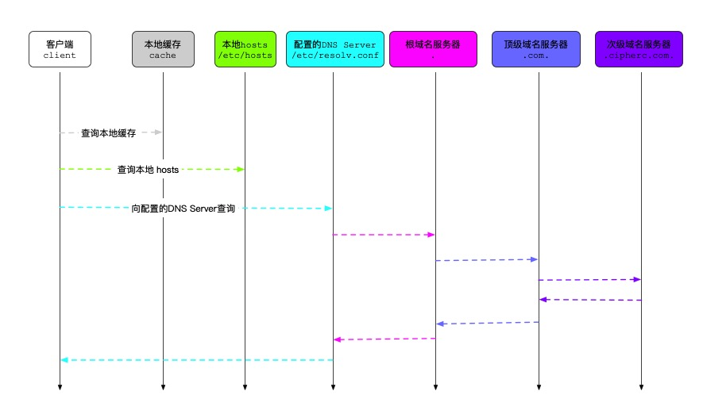

----

# DNS

DNS(Domain Name System) 是互联网的核心协议之一，它的作用非常简单，就是根据域名查出域名对应的IP地址。
这样应用在访问互联网服务时，才可以真正的将请求发送到对应的服务器上。

## DNS/域名层级结构

以域名 `blog.cipherc.com` 为例，该域名的完整域名，其实是 `blog.cipherc.com.root`，也可以简写
为 `blog.cipherc.com.`。

* 根域名：`.` 或者 `.root`
* 顶级域名：top-level domain，缩写成 TLD。该例子中是：`.com.`

    顶级域名又称一级域名，顶级域名可以分为三类，即 gTLD / ccTLD 和 NEW gTLD：

    * gTLD：国际顶级域名（generic top-level domains，gTLD），例如：.com/.net/.org等都属于gTLD；
    * ccTLD：国家和地区顶级域名（country code top-level domains，简称ccTLD），例如：中国是.cn域名，日本是.jp域名；
    * New gTLD：新顶级域名（New gTLD），例如：.xyz/.top/.red/.help等新顶级域名。

* 次级域名：second-level domain，缩写成 SLD。该例子中是：`cipherc.com.`
* 主机名：`blog.cipherc.com.`

主机名.次级域名.顶级域名.根域名，即 `host.sld.tld.root`

## DNS 记录类型

* `A`: 一个`A`记录可能指向多个IP地址。
* `AAAA`: `A` 是 IPv4，`AAAA` 是 IPv6。
* `CNAME`: Canonical Name, 一个`CNAME`记录指向另一个`CNAME`记录或域名。当前查询的域名是另一个域名的跳转。
* `NS`: 域名服务器记录（Name Server），返回保存下一级域名信息的服务器地址。该记录只能设置为域名，不能设置为IP地址。
* `MX`: 邮件记录（Mail eXchange），返回接收电子邮件的服务器地址。
* `PTR`: 逆向查询记录（Pointer Record），只用于从IP地址查询域名。
* `SOA`: 起始授权机构记录
* `TXT`: 可以将任何信息存储到 TXT 记录中，例如联系方式或者你希望人们在查询 DNS 服务器时可获得的任意其他信息。

```
dig www.baidu.com @114.114.114.114
dig www.baidu.com A @114.114.114.114
dig www.baidu.com AAAA @114.114.114.114
# 一次请求多种域名记录
dig www.baidu.com A www.baidu.com AAAA @114.114.114.114
```

### 例子

* `SOA` 记录

按如下形式开始描述一个站点的 DNS 条目：

```
example.com.   86400  IN   SOA   ns1.example.com.   mail.example.com.  (
2017012604 ;serial
86400 ;refresh, seconds
7200 ;retry, seconds
3600000 ;expire, seconds
86400 ;minimum, seconds
)
```

第一行以域名 example.com 开始，以句号结束——该语句和 / etc/named.conf 文件中的区域定义是一致的。我们要始终记得，DNS 配置文件是极其挑剔的。

IN 告诉域名服务器：这是一条网络记录。

SOA 告诉域名服务器：这是一条起始授权机构记录。

ns1.example.com. 是该文件所在域的域名服务器的完全合格域名（FQDN: Fully Qualified Domain Name)。

mail.host.com. 是域管理员的邮箱地址。你会发现这个邮箱地址没有 “@” 标志，而是被句号所取代，并且末尾还有一个句号。

第 2 行是一个序列码，它被用来告诉域名服务器文件是什么时候升级的。因此，如果你对区域码做了变更，你必须对这个序列码进行递增。这个序列码的格式是 YYYYMMDDxx ，其中的 xx 是从 00 开始的。

第 3 行是每秒刷新率。这个值被用来告诉第二个域名服务器查询主服务器中的记录是否已经被更新的频率。

第 4 行是每秒重试的频率。如果第二个服务器多次尝试连接主域名服务器来进行更新检测，但无法连接上的时候，第二个服务器就会在每秒内重试指定的数值次数。

第 5 行是超时指示。其目的是为了第二个服务器能将区域数据缓存下来。这个值告诉这些服务器如果它们不能连接到主服务器来进行更新，那么它们就会在这个指定数值秒数之后抛弃这个值。

第 6 行告诉缓存服务器，如果它们不能连接到主域名服务器时，它们应该在超时前等待多久。


* `NS` 记录

用于指定哪个名称服务器维护该域的记录。

你可以这样编写的 NS 记录：

```
IN      NS     ns1.example.com.
IN      NS     ns2.example.com.
```

并不需要有 2 个 NS 记录，但是通常偏好有备份名称服务器。

* `TXT` 记录

您可以将任何信息存储到 TXT 记录中，例如你的联系方式或者你希望人们在查询 DNS 服务器时可获得的任意其他信息。

你可以这样保存 TXT 记录：example.com. IN TXT ” YOUR INFO GOES HERE”.

此外，RP 记录被创建为对 host 联系信息的显式容器：example.com. IN RP mail.example.com. example.com。

### DNS 解析过程

1. 本地缓存（如浏览器等）

1. 本地hosts

1. 配置的DNS服务器（如 Ubuntu 里用的 `/etc/resolv.conf`）

`dig` 命令在加 `+trace` 选项时，可以输出向 DNS server 查询时的完整分级查询过程：

```
root@owning:~# dig blog.cipherc.com @114.114.114.114 +trace
```

列出所有根域名 `.` 的 `NS` 记录，即所有的根域名服务器。
```
; <<>> DiG 9.9.5-3ubuntu0.19-Ubuntu <<>> blog.cipherc.com @114.114.114.114 +trace
;; global options: +cmd
.			2069	IN	NS	i.root-servers.net.
.			2069	IN	NS	l.root-servers.net.
.			2069	IN	NS	c.root-servers.net.
.			2069	IN	NS	h.root-servers.net.
.			2069	IN	NS	f.root-servers.net.
.			2069	IN	NS	j.root-servers.net.
.			2069	IN	NS	b.root-servers.net.
.			2069	IN	NS	d.root-servers.net.
.			2069	IN	NS	a.root-servers.net.
.			2069	IN	NS	e.root-servers.net.
.			2069	IN	NS	m.root-servers.net.
.			2069	IN	NS	g.root-servers.net.
.			2069	IN	NS	k.root-servers.net.
;; Received 239 bytes from 114.114.114.114#53(114.114.114.114) in 37 ms
```

根据本地内置的根域名服务器IP地址，DNS服务器向所有这些IP地址发出查询请求，询问 `blog.cipherc.com` 的
顶级域名服务器 `.com.` 的 `NS` 记录。
```
com.			172800	IN	NS	a.gtld-servers.net.
com.			172800	IN	NS	b.gtld-servers.net.
com.			172800	IN	NS	c.gtld-servers.net.
com.			172800	IN	NS	d.gtld-servers.net.
com.			172800	IN	NS	e.gtld-servers.net.
com.			172800	IN	NS	f.gtld-servers.net.
com.			172800	IN	NS	g.gtld-servers.net.
com.			172800	IN	NS	h.gtld-servers.net.
com.			172800	IN	NS	i.gtld-servers.net.
com.			172800	IN	NS	j.gtld-servers.net.
com.			172800	IN	NS	k.gtld-servers.net.
com.			172800	IN	NS	l.gtld-servers.net.
com.			172800	IN	NS	m.gtld-servers.net.
com.			86400	IN	DS	30909 8 2 E2D3C916F6DEEAC73294E8268FB5885044A833FC5459588F4A9184CF C41A5766
com.			86400	IN	RRSIG	DS 8 1 86400 20200526210000 20200513200000 48903 . XhVUrfbc1K9L/+vjiwPpBANJr1o0EI+WKZBZlRuOYCHZn9GTBMC4rRPe eA7Dl+Vbysdqils18hDhRlI2rNxvNe0n8Xa7YMbj9ejbotFsXWMcFk4Y KEYx66DiRVV6k+5C/EShIFRj0WB0ZcxnnnWTE7/F/eQrrEyGaNCM5CfX EnNkQa1ypX7mkrKZPgw11892GkkgNBGc3fdu+Tyy7vA+JomYawoZ0YcE qWzIwmAsKgmsy9JAgSJCPnrRHDLWfWqrcyWToKTJ1DraZmna7fZ3jAFM TdROz5oMFF9NJCaDoOh+H3HYMmArmYUhK3utiC9pzGlF+oGQPi0N0pRC WuzNuA==
;; Received 1176 bytes from 193.0.14.129#53(k.root-servers.net) in 42 ms
```
上述结果显示 `.com.` 域名有 13 条 `NS` 记录，同时返回的还有每一条记录对应的 IP 地址。
最先返回结果的 `NS` 服务器是 `k.root-servers.net`，IP 地址为 `193.0.14.129`。

然后 DNS 服务器向这些顶级域名服务器发出查询，询问 `blog.cipherc.com` 的次级域名 `cipherc.com` 的 `NS` 记录。
```
cipherc.com.		172800	IN	NS	f1g1ns1.dnspod.net.
cipherc.com.		172800	IN	NS	f1g1ns2.dnspod.net.
CK0POJMG874LJREF7EFN8430QVIT8BSM.com. 86400 IN NSEC3 1 1 0 - CK0Q1GIN43N1ARRC9OSM6QPQR81H5M9A NS SOA RRSIG DNSKEY NSEC3PARAM
CK0POJMG874LJREF7EFN8430QVIT8BSM.com. 86400 IN RRSIG NSEC3 8 2 86400 20200517044906 20200510033906 39844 com. fj2PYeTw6yFFiXB/bKnR9TL2AC5Bk2kIyLOBDhNJ8lguZ+lsgS4AMe+r 4+YIWfx0ZSuNy3I7vPMF8sAJYtWVetJ6J7mq0y0t3mHhU+UlnwCCkUFD oeZflGosYxBWM/g52x3sOfSHXOnPlMa16dg0I79sffKl4roiTqAJwsN/ 99jCjU1Gq4LABxil4oXRlizZFRW1l7ybqpFRF/TowekY+g==
SCFOMUH58L43T1RCHJJDPS31V9CNLV70.com. 86400 IN NSEC3 1 1 0 - SCFR57NBDTQB5ETD58704KHAB3LOL4BB NS DS RRSIG
SCFOMUH58L43T1RCHJJDPS31V9CNLV70.com. 86400 IN RRSIG NSEC3 8 2 86400 20200517044839 20200510033839 39844 com. OUFpDfHUZCjHRty0hq2Vxvy87quK+nMxrYjrUvQXKuP85hm7yET/rM0E Ssmq6mNVUCy4H+wHRDXgT2tp6EQnfh9Zto0uX6kGs6bAn6NC92Gjub/G joRALlj9ByFYE8J6CgvZ2aW4QB53KV1w1SQ2x+B5itngtBKvsUR/ddoJ rKVj8zAMcvcrz93+YSZO9d7SaaRKkZGtNxRd2uhN69RWcA==
;; Received 648 bytes from 192.12.94.30#53(e.gtld-servers.net) in 290 ms
```
上述结果显示 `cipherc.com` 有 2 条 `NS` 记录，同时返回的还有每一条记录对应的 IP 地址。
最先返回结果的 `NS` 服务器是 `e.gtld-servers.net`，IP 地址为 `192.12.94.30`。

DNS服务器向上面这四台NS服务器查询 `blog.cipherc.com` 的主机名。
```
blog.cipherc.com.	600	IN	A	103.61.39.66
cipherc.com.		86400	IN	NS	f1g1ns2.dnspod.net.
cipherc.com.		86400	IN	NS	f1g1ns1.dnspod.net.
;; Received 125 bytes from 58.247.212.119#53(f1g1ns2.dnspod.net) in 34 ms
```
上述结果显示 `blog.cipherc.com` 有 1 条 A 记录，同时返回的还有对应的 IP 地址 `103.61.39.66`。
最先返回结果的 NS 服务器是 `f1g1ns2.dnspod.net`，IP 地址为 `58.247.212.119`。



### 参考

* [DNS 原理入门](http://www.ruanyifeng.com/blog/2016/06/dns.html)
* [DNS访问原理只需9个步骤](https://blog.51cto.com/14279308/2481205)

## /etc/resolv.conf 中的三个参数

* nameserver

指定 DNS server 的 IP；可以指定多个。
比如：
```
nameserver 192.168.1.1
nameserver 114.114.114.114
nameserver 8.8.8.8
```

* domain

指定本地 domain。如果查询时域名里没有“.”，则会在此后面加上 domain 的值来进行解析。

* search

若搜索的域名没有找到，则将域名拼接上 search 来搜索。

*`dig`命令默认不会拼接`search`，除非显式指定*

```
nameserver 192.168.1.1
nameserver 8.8.8.8
domain  sina.com.cn
search  sina.com baidu.com


ping qing.blog.sina.com.cn   ### 这里就老老实实的走nameserver吧
ping blog
### 按顺序查找<strong>blog</strong>，<strong>blog.sina.com.cn</strong>,<strong>blog.sina.com</strong>和<strong>blog.baidu.com</strong>
### 这里的顺序是<strong>nameserver,domain,search</strong>

ping qing.blog
### 此处就只查找<strong>qing.blog</strong>，<strong>qing.blog.sina.com</strong>和<strong>qing.blog.baidu.com</strong>
### 这里的顺序是<strong>nameserver,<s>domain,</s>search</strong>
### domain此时没有起到作用，因为其定义是<strong>当搜索的domain没有"."时，则优先搜索domain，否则跳过</strong>
```

http://www.lnmpy.com/resolv.conf-search-domain/

## PTR / arpa 解析

在比较新的bind9版本中，已经内置了一些内网IP段的empty zones。

开了这个功能后，正常情况，解析这些内网IP的PTR，应该立即返回 NXDOMAIN。

```
root@dnsmaster0:~# time nslookup 192.168.1.2 172.31.20.79
Server:         172.31.20.79
Address:        172.31.20.79#53

** server can't find 2.1.168.192.in-addr.arpa: NXDOMAIN


real    0m0.011s
user    0m0.004s
sys     0m0.004s
root@dnsmaster0:~#
```

### 参考

* http://www.zytrax.com/books/dns/ch7/queries.html#disable-empty-zone
* https://kb.isc.org/docs/aa-00800
* https://access.redhat.com/solutions/46558
* [Built-in Empty Zones] Bin9ARM.pdf

## Ubuntu 18 systemd-resolved

Ubuntu 18 以后，有了自己的 systemd-resolved 来维护内部的DNS。

```
systemd-resolved --status

# 给 `systemd-resolved` 打开 DEBUG
systemctl edit systemd-resolved
# 增加以下内容
[Service]
Environment=SYSTEMD_LOG_LEVEL=debug
# 再重启服务
systemctl restart systemd-resolved

# 可以在 /var/log/syslog 中看到 resolved 的日志；或者
journalctl -u systemd-resolved -f
```

--------------------------------------------------------------------------------

# Q&A

[unsolved]Q3: 如何从客户端操作系统层面关掉 `AAAA` 的请求

客户端发请求 `nslookup www.baidu.com 114.114.114.114`，总是会同时请求 `A` 和 `AAAA` 记录：

```
10:56:39.491244 IP 10.140.68.121.33738 > 114.114.114.114.53: 56787+ A? www.baidu.com. (31)
10:56:39.516349 IP 114.114.114.114.53 > 10.140.68.121.33738: 56787 3/0/0 CNAME www.a.shifen.com., A 180.101.49.11, A 180.101.49.12 (90)
10:56:39.517996 IP 10.140.68.121.45761 > 114.114.114.114.53: 50271+ AAAA? www.a.shifen.com. (34)
10:56:39.538501 IP 114.114.114.114.53 > 10.140.68.121.45761: 50271 0/1/0 (97)
```

目前已知的几个方法均不管用。

* https://askubuntu.com/questions/32298/prefer-a-ipv4-dns-lookups-before-aaaaipv6-lookups
* https://serverfault.com/questions/632665/how-to-disable-aaaa-lookups
* https://ubuntuforums.org/showthread.php?t=1668964

Q2: dns client 对于多个 nameserver 的行为

通常来说，可以认为大部分OS（猜测+一些链接说明，以及经验），会按照配置的nameserver的顺序去解析。

当一个nameserver解析失败时，才会按顺序切换下一个DNS解析。

* https://github.com/systemd/systemd/issues/5755

Q1: Difference between NXDOMAIN and 'no answer' ?

从 RFC1035 可以查到，RCODE 当时定义了六个值：
```
RCODE           Response code - this 4 bit field is set as part of
                responses.  The values have the following
                interpretation:

                0               No error condition

                1               Format error - The name server was
                                unable to interpret the query.

                2               Server failure - The name server was
                                unable to process this query due to a
                                problem with the name server.

                3               Name Error - Meaningful only for
                                responses from an authoritative name
                                server, this code signifies that the
                                domain name referenced in the query does
                                not exist.

                4               Not Implemented - The name server does
                                not support the requested kind of query.

                5               Refused - The name server refuses to
                                perform the specified operation for
                                policy reasons.  For example, a name
                                server may not wish to provide the
                                information to the particular requester,
                                or a name server may not wish to perform
                                a particular operation (e.g., zone
                                transfer) for particular data.

                6-15            Reserved for future use.
```

从 `dig` 的源码来看，`dig` 对于 rcode 的定义更丰富些。
```
/*% return code text */
static const char * const rcodetext[] = {
	"NOERROR",
	"FORMERR",
	"SERVFAIL",
	"NXDOMAIN",
	"NOTIMP",
	"REFUSED",
	"YXDOMAIN",
	"YXRRSET",
	"NXRRSET",
	"NOTAUTH",
	"NOTZONE",
	"RESERVED11",
	"RESERVED12",
	"RESERVED13",
	"RESERVED14",
	"RESERVED15",
	"BADVERS"
};
```

* `NXDOMAIN`，只有当该结果是从权威NS服务器返回时，才表明该域名确实是不存在的。

* `NOERROR`，
* `NODATA`，`dig` 特有的，表示 `NOERROR` 并且 `ANSWER` 为 0，真实含义是该域名有多种记录，但没有一个记录符合所请求的记录。
    > So what does NOERROR with an ANSWER of 0 actually represent? It means one or more resource records exist for this domain but there isn’t a record matching the resource record type (A, AAAA, MX, etc.).

* [dig.c](http://ftp.isc.org/isc/bind9/9.9.0rc1/bind-9.9.0rc1/bin/dig/dig.c)
* [RFC1035](https://tools.ietf.org/html/rfc1035)
* [The subtleties between the NXDOMAIN, NOERROR and NODATA DNS response codes](https://prefetch.net/blog/2016/09/28/the-subtleties-between-the-nxdomain-noerror-and-nodata-dns-response-codes/)

--------------------------------------------------------------------------------
