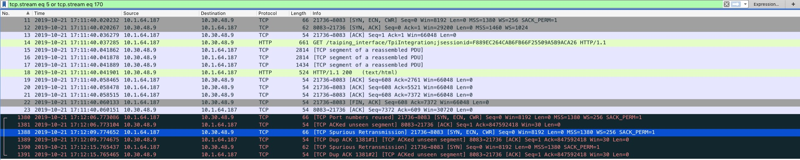

### 现象

一个私有云，浏览器访问负载均衡器（HAProxy）时，会请求这个地址的大量静态文件，但同一次刷新，有些文件能请求成功，有些文件会失败，浏览器报：

```
GET http://10.30.48.9:8083/taiping_interface/js/pdp-common/pdePurview.js net::ERR_CONNECTION_TIME_OUT
GET http://10.30.48.9:8083/taiping_interface/js/pdp-common/cookie.js net::ERR_CONNECTION_TIME_OUT
GET http://10.30.48.9:8083/taiping_interface/js/pdp-common/Menu.js net::ERR_CONNECTION_TIME_OUT
GET http://10.30.48.9:8083/taiping_interface/js/pdp-common/pdehome.js net::ERR_CONNECTION_TIME_OUT
```

并且这些失败的文件不是固定的，有时能成功，有时会失败。

### 分析

抓包看，从客户端和服务端，都能抓到除正常连接外的大量`TCP Port numbers reused`连接。



所以猜测，可能是客户端复用了源端口导致的。

有两个思路，1. 要么就缓解客户端复用源端口的情况（`TcpTimedWaitDelay`）；2. 要么就允许服务端支持客户端复用源端口的情况（`net.ipv4.tcp_tw_reuse`）。

> The "right" way to solve this problem is to add more tuples - increase outgoing ports on the client (which you have done), add listening ports on the server, add IP aliases onto your interfaces, and make the apps use those additional IPs/ports.
> A "less right" way is to decrease the TW timeout, which I think you are doing with TcpTimedWaitDelay.
> A "not very right at all but still quite popular" way is to enable socket recycling, Linux has options tw_reuse and tw_recycle, maybe Windows has an equivalent.
> The last two options break the TCP RFC. Maybe the ACE has a problem with doing that?

结果发现，LB上，本来应该配上 `net.ipv4.tcp_tw_reuse` 的，但却没有配置：

```
root@i-rgtx97ak:~# sysctl -a | grep reuse
net.ipv4.vs.conn_reuse_mode = 1
root@i-rgtx97ak:~#
```

4.4.110 内核，确实没有导出这个配置，只能给 host 配置，是正常的。

> 4.4内核net.ipv4.tcp_tw_reuse不作为net namespace内容导出，4.15是会的
> https://elixir.bootlin.com/linux/v4.4.196/source/net/ipv4/sysctl_net_ipv4.c#L819 这里ipv4_net_table是导出给cm的/proc/sys/net/ipv4的sysctl项

根源在于 haproxy 配置了 `option forceclose`，这种情况，会强制关闭，导致客户端没法复用连接。

### 解决办法

把 haproxy 的 `option forceclose` 改为 `option http-keep-alive`。

### 参考

* https://serverfault.com/questions/541070/linux-tcp-source-port-reuse-and-delay
* https://www.cnblogs.com/shanyou/archive/2008/12/19/1358267.html
