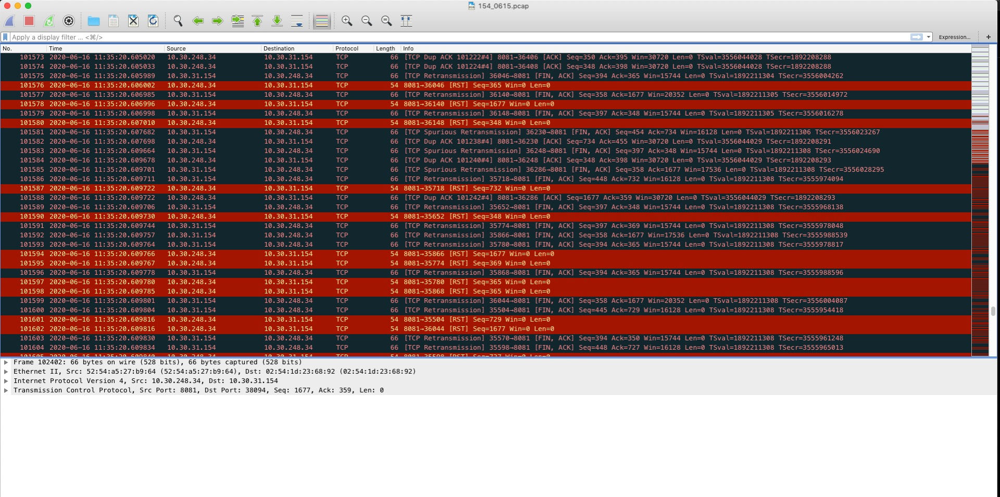
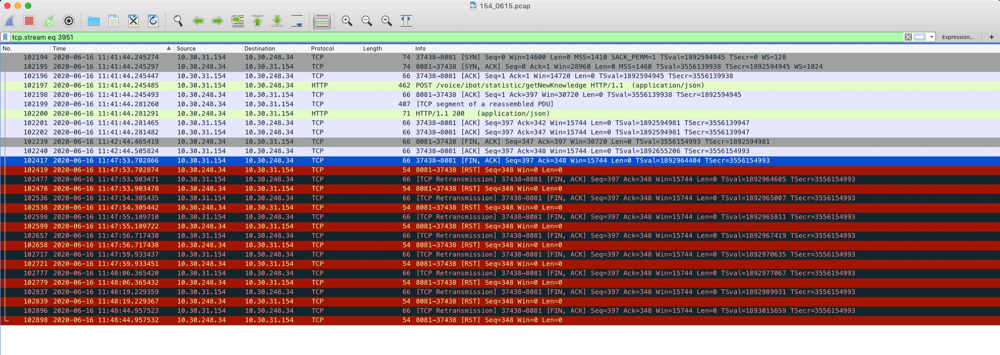
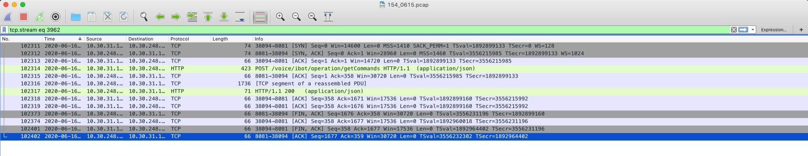

### 现象

客户反馈在负载均衡器上能看到大量的 RST 包，如下截图：



### 分析

跟踪其中一个流，如下截图：



仔细分析，有如下特征：

1. 这是一个完整的 HTTP 请求过程，所有交互都已经在发送 RST 前正常完成了
2. 只有在连接完成，准备做连接关闭的四次挥手过程中，才会有 LB 往客户端发 RST 包的现象。

于是，进一步对比了正常的流，如下截图：



发现连接其实是能够正常关闭的。

分析到这，不得其解，转而去分析 RST flag 的特点。

#### FIN VS. RST

|FIN|RST|
|--|--|
|Gracefully terminates the connection.|Abruptly tells the other side to stop communicating.|
|Only one side of conversation is stopped.|The whole conversation is stopped.|
|No data loss.|Data is discarded.|
|Receiver of FIN keeps communicating till it wants to.|Receiver has to stop communication.|

可能发RST的情况：

> One reason a device will send a RST is in response to receiving a packet for a closed socket.

分析得知，RST 包发送的原因，很可能是因为这个 socket 已经关闭了。于是转而去看图二的异常流，
发现了端倪：四次挥手过程中，第二个包（ACK）距第三个包（FIN）的时间很长，接近五分钟。

第二个包和第三个包之间的状态是`FIN_WAIT_2`，该状态的超时设置是 120s。

```
root@i-e538fkrw:~# sysctl -a | grep fin_wait
net.netfilter.nf_conntrack_tcp_timeout_fin_wait = 120
root@i-e538fkrw:~#
```

### 结论

当四次挥手超时时，LB会把socket回收，后续如果再收到往这个socket的发包，就会响应 RST。

### 参考

* [What causes a TCP/IP reset (RST) flag to be sent?](https://stackoverflow.com/questions/251243/what-causes-a-tcp-ip-reset-rst-flag-to-be-sent)
