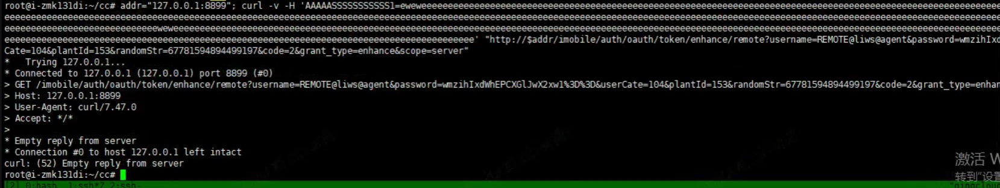
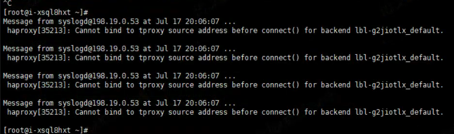
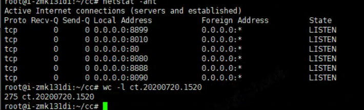
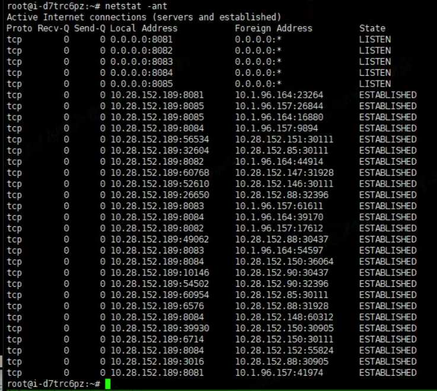
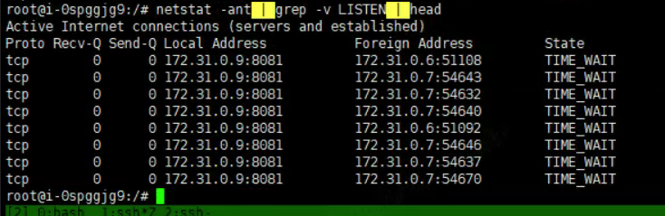

### 现象



即便是请求本机的端口，连接也会马上被中断。

### 分析



haproxy 日志发现，每收到一个请求，日志里就会报：

```
Cannot bind to tproxy source address before connect() for backend xxx.
```

于是尝试把透明代理的配置先关掉：

```
# source 0.0.0.0 usesrc client
```

发现问题消失。

根据该报错继续分析、搜索，结果发现Google几乎不能看到任何线索。

于是去看了 haproxy 的源码，发现这里的报错，大致是由于在透明模式下，haproxy 会把这个客户端的地址绑定到本地，而在做`bind`时出错了：

```
		if (unlikely(ret != 0)) {
			port_range_release_port(fdinfo[fd].port_range, fdinfo[fd].local_port);
			fdinfo[fd].port_range = NULL;
			close(fd);

			if (ret == 1) {
				ha_alert("Cannot bind to source address before connect() for backend %s. Aborting.\n",
					 be->id);
				send_log(be, LOG_EMERG,
					 "Cannot bind to source address before connect() for backend %s.\n",
					 be->id);
			} else {
				ha_alert("Cannot bind to tproxy source address before connect() for backend %s. Aborting.\n",
					 be->id);
				send_log(be, LOG_EMERG,
					 "Cannot bind to tproxy source address before connect() for backend %s.\n",
					 be->id);
			}
			conn->flags |= CO_FL_ERROR;
			return SF_ERR_RESOURCE;
		}
```

继而猜测这个问题，可能和当前 kernel 的网络有关。

偶然间，用 `netstat -ant` 命令查看，发现这里也有一些异常：



继续检查了同一台物理机上的其它LB节点和其它物理机上的LB节点，均没有这个问题：





排查到这里后，没有更具体的线索可以定位了，猜测问题可能是这样的：

netstat看不到LISTEN以外的连接，可能是网络模块出了问题，导致haproxy bind时失败。

重启该节点后，问题小时。

### 结论

无。
