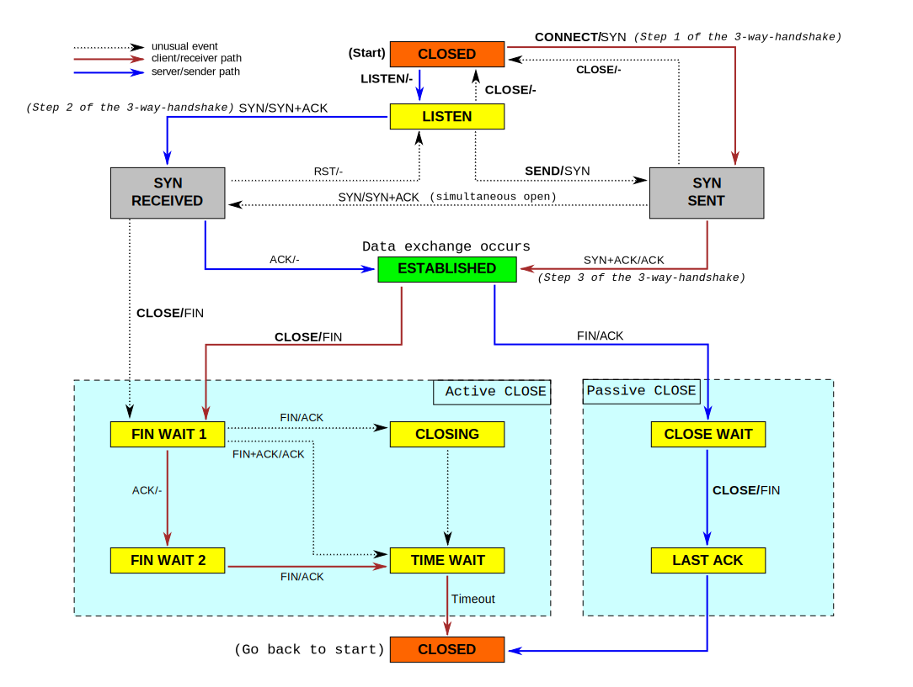

----

总端口数为65536。如果一个客户端持续向某个固定的服务端IP反复建立连接并迅速释放（如压测场景），会导致因总端口数限制，并发压不上去。
也就是说，这个是以五元组为单位，在conntrack表里记录的。

为了突破这种限制，需要找多个客户端、多个服务端来压测。

----

/etc/services 查看端口服务

----

《TCP/IP 详解 卷一》
ch 3.9
ch 9


* https://mp.weixin.qq.com/s/hnstE9WgvShE3qZcWWbUJQ
* https://www.geeksforgeeks.org/computer-network-tcp-flags/
* https://blog.csdn.net/cws1214/article/details/52430554

```
# 加上 -S，显示绝对的 seq no.
root@server1-2:~# tcpdump -i eth0 host 192.168.1.3 -vS

# 三次握手
tcpdump: listening on eth0, link-type EN10MB (Ethernet), capture size 262144 bytes
11:08:33.818518 IP (tos 0x0, ttl 64, id 5984, offset 0, flags [DF], proto TCP (6), length 60)
    192.168.1.3.36674 > 192.168.1.2.http: Flags [S], cksum 0xcdcb (correct), seq 3048788168, win 29200, options [mss 1410,sackOK,TS val 2806237096 ecr 0,nop,wscale 7], length 0
11:08:33.818578 IP (tos 0x0, ttl 64, id 0, offset 0, flags [DF], proto TCP (6), length 60)
    192.168.1.2.http > 192.168.1.3.36674: Flags [S.], cksum 0x8384 (incorrect -> 0x7b24), seq 1852294199, ack 3048788169, win 28960, options [mss 1460,sackOK,TS val 2806282608 ecr 2806237096,nop,wscale 7], length 0
11:08:33.818779 IP (tos 0x0, ttl 64, id 5985, offset 0, flags [DF], proto TCP (6), length 52)
    192.168.1.3.36674 > 192.168.1.2.http: Flags [.], cksum 0x1a2c (correct), ack 1852294200, win 229, options [nop,nop,TS val 2806237096 ecr 2806282608], length 0

# 四次挥手
# TCP 规定，ACK 可以捎带在其他数据包中，所以四次挥手中2/3包就被合并在一起了。
# 如果主动断开的一方发送FIN之后，被动一方仍然有数据要继续发送，就会先ACK这个FIN，然后继续发送数据（在此过程中主动断开一方仍然会继续ACK这些数据），直到数据发送完毕之后再发送FIN并接收对方的ACK。这时就能看到四个包。
11:08:33.818923 IP (tos 0x0, ttl 64, id 5986, offset 0, flags [DF], proto TCP (6), length 52)
    192.168.1.3.36674 > 192.168.1.2.http: Flags [F.], cksum 0x1a2b (correct), seq 3048788169, ack 1852294200, win 229, options [nop,nop,TS val 2806237096 ecr 2806282608], length 0
11:08:33.818962 IP (tos 0x0, ttl 64, id 48456, offset 0, flags [DF], proto TCP (6), length 52)
    192.168.1.2.http > 192.168.1.3.36674: Flags [F.], cksum 0x837c (incorrect -> 0x1a2c), seq 1852294200, ack 3048788170, win 227, options [nop,nop,TS val 2806282608 ecr 2806237096], length 0
11:08:33.819122 IP (tos 0x0, ttl 64, id 5987, offset 0, flags [DF], proto TCP (6), length 52)
    192.168.1.3.36674 > 192.168.1.2.http: Flags [.], cksum 0x1a2a (correct), ack 1852294201, win 229, options [nop,nop,TS val 2806237096 ecr 2806282608], length 0

```


###

|No.|Direction|Src|Dst|Length|TCP Segment Len|Flags|Seq(absolutely,relative)|Ack|Msg|
|--|--|--|--|--|--|--|--|--|
|1|->|client|server|66|0|SYN|3927753347(0)||客户端主动建立连接|
|2|<-|server|client|62|0|SYN,ACK|1794486207(0)|3927753348(0)|服务端响应握手连接|
|3|->|client|server|54|0|ACK|3927753348(1)|1794486208(1)|三次握手完成|
|4|->|client|server|661|607|PSH,ACK|3927753348(1)|1794486208(1)|客户端发HTTP请求：GET /taiping_interface/TpiIntegration;jsessionid=F889EC264CAB6FB66F25509A5B9ACA26 HTTP/1.1|
|5|<-|server|client|2814|2760|ACK|1794486208(1)|3927753955(608)|服务端返回数据|
|6|<-|server|client|2814|2760|ACK|1794488968(2761)|3927753955(608)|服务端返回数据|
|7|<-|server|client|1434|1380|ACK|1794491728(5521)|3927753955(608)|服务端返回数据|
|8|<-|server|client|524|470|FIN,ACK|1794493108(6901)|3927753955(608)|服务端发送完数据后，响应状态码：HTTP/1.1 200 (text/html)；同时，发送FIN，主动断开连接。|
|9|->|client|server|54|0|ACK|3927753955(608)|1794488968(2761)|客户端确认数据收到|
|10|->|client|server|54|0|ACK|3927753955(608)|1794491728(5521)|客户端确认数据收到|
|11|->|client|server|54|0|ACK|3927753955(608)|1794493579(7372)|客户端确认数据收到|
|12|->|client|server|54|0|FIN,ACK|3927753955(608)|1794493579(7372)|客户端挥手拒绝。TCP 规定，ACK 可以捎带在其它数据包种，所以四次挥手的2/3包就被合并在一起了。|
|13|<-|server|client|54|0|ACK|1794493579(7372)|3927753956(609)|服务端确认连接断开|

### FIN VS. RST

|FIN|RST|
|--|--|
|Gracefully terminates the connection.|Abruptly tells the other side to stop communicating.|
|Only one side of conversation is stopped.|The whole conversation is stopped.|
|No data loss.|Data is discarded.|
|Receiver of FIN keeps communicating till it wants to.|Receiver has to stop communication.|

可能发RST的情况：

> One reason a device will send a RST is in response to receiving a packet for a closed socket.

* https://stackoverflow.com/questions/251243/what-causes-a-tcp-ip-reset-rst-flag-to-be-sent

### `Connection reset` VS. `Connection reset by peer`

服务器返回了"RST"时，如果此时客户端正在从Socket套接字的输出流中读数据则会提示"Connection reset"；

服务器返回了“RST”时，如果此时客户端正在往Socket套接字的输入流中写数据则会提示"Connection reset by peer"。

### 扫描、探测技术

> TCP Half-Open

> One of the more common and popular port scanning techniques is the TCP Half-Open port scan, sometimes referred to as SYN scan. It’s a fast and sneaky scan that tries to find potential open ports on the target computer. This scan is fast because it never completes the full TCP 3 way-handshake. The scanner sends a SYN message and just notes the SYN-ACK responses. The scanner doesn’t complete the connection by sending the final ACK: it leaves the target hanging.

> Any SYN-ACK responses are possible connections: an RST(reset) response means the port is closed, but there is a live computer here. No responses indicate SYN is filtered on the network. Any SYN-ACK replies are a quick way cybercriminals can find the next potential target.


* https://www.varonis.com/blog/port-scanning-techniques/

### tcp flags

|TCP Flags|tcpdump flags|Meaning|
|--|--|--|
|SYN|S|Syn packet, a session established request.|
|ACK|A|Ack packet, acknowledge sender's data.|
|FIN|F|Finish flag, indication of termination.|
|RESET|R|Reset, indication of immediate abort of connection.|
|PUSH|P|Push, immediate push of data from sender.|
|URGENT|U|Urgent, takes precedence over other data.|
|NONE|A dot.|Placeholder, usually used for ACK.|

* https://amits-notes.readthedocs.io/en/latest/networking/tcpdump.html


### State Explantion


`linux.git/Documentation/networking/nf_conntrack-sysctl.txt`


```
net.netfilter.nf_conntrack_max = 4194304

net.netfilter.nf_conntrack_tcp_be_liberal = 0
net.netfilter.nf_conntrack_tcp_loose = 1
net.netfilter.nf_conntrack_tcp_max_retrans = 3
net.netfilter.nf_conntrack_tcp_timeout_close = 10
net.netfilter.nf_conntrack_tcp_timeout_close_wait = 60
net.netfilter.nf_conntrack_tcp_timeout_established = 432000
net.netfilter.nf_conntrack_tcp_timeout_fin_wait = 120
net.netfilter.nf_conntrack_tcp_timeout_last_ack = 30
net.netfilter.nf_conntrack_tcp_timeout_max_retrans = 300
net.netfilter.nf_conntrack_tcp_timeout_syn_recv = 60
net.netfilter.nf_conntrack_tcp_timeout_syn_sent = 120
net.netfilter.nf_conntrack_tcp_timeout_time_wait = 120
net.netfilter.nf_conntrack_tcp_timeout_unacknowledged = 300
root@owning:~#
```

* SYN_SEND

    Indicates active open.

* SYN_RECEIVED

    The server just received SYN from the client.

* ESTABLISHED

    Client received server's SYN and the session is established.

* LISTEN

    Server is ready to accept connection.

* FIN_WAIT_1

    Indicates active close.

* TIME_WAIT

    The **local endpoint** enters this state after active close.
    The **local endpoint** (this side) has closed the connection.

    ```
    net.netfilter.nf_conntrack_tcp_timeout_time_wait = 120
    ```

* CLOSE_WAIT

    Indicates passive close.
    The **local endpoint** just received first FIN from the **remote endpoint** .
    The **remote endpoint** (other side of the connection) has closed the connection.
    CLOSE_WAIT means your program is still running, and hasn't closed the socket (and the kernel is waiting for it to do so). Add -p to netstat to get the pid, and then kill it more forcefully (with SIGKILL if needed). That should get rid of your CLOSE_WAIT sockets. You can also use ps to find the pid.
    SO_REUSEADDR is for servers and TIME_WAIT sockets.

    ```
    net.netfilter.nf_conntrack_tcp_timeout_close_wait = 60
    ```

* FIN_WAIT_2

    Client just received acknowledgement of its first FIN from the server.

* LAST_ACK

    Server is in this state when it sends its own FIN.

    `net.netfilter.nf_conntrack_tcp_timeout_last_ack`
    `net.ipv4.tcp_retries2`

    * https://testerhome.com/topics/15824?order_by=created_at&
    * http://perthcharles.github.io/2015/09/07/wiki-tcp-retries/

* CLOSED

    Server received ACK from client and connection is closed.




http://benohead.com/tcp-about-fin_wait_2-time_wait-and-close_wait/


### 命令

```
-r          Kernel routing table
-i          All network interfaces
-n          Numeric
```

* 统计状态

```
netstat -na | awk '/^tcp/ {++S[$NF]} END {for(a in S) print S[a], a}' | sort -nr

netstat -na |awk '/^tcp/ {print NF,$NF,S[$NF],++S[$NF]}'

netstat -na |awk '/^tcp/ {print NF,$NF}'
```

----
